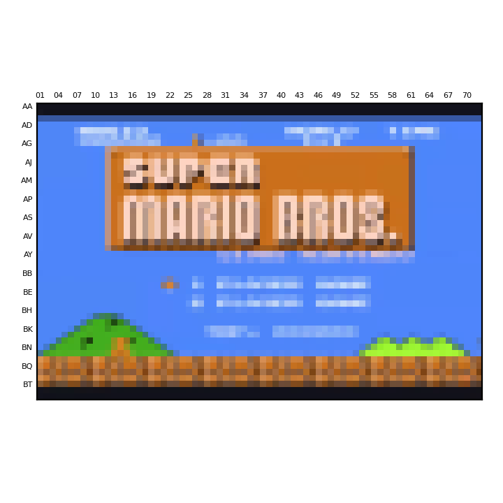
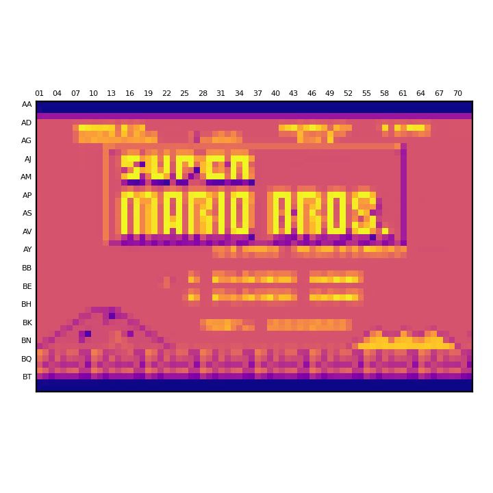
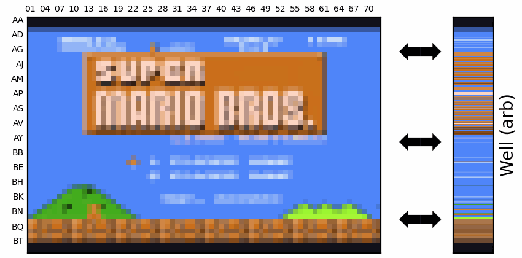

`plate_tx` transforms plate-based data into flat files (and vice versa).

- `plate_tx` is *robust*, automatically working on the following plate types:
    - `6,12,24,48,96,384,1635,3456`
- `plate_tx` is *flexible*, comaptible wth the common file formats
  - 2D plate layouts:
  ```
    HCS CELLOMICS
    DELFIA ENVISION
    ANALYST GT
    BMG LABTECH
    CLARIOSTAR
    DEFAULT PLATE
  ```
  - Flat-files
  ```
    DEFAULT FLAT
    BMG PHERASTAR
    DELFIA ENVISION FLAT
  ```

# Installation

    git https://github.com/prheenan/plate_tx.git
    cd plate_tx
    conda env create --force --yes -f env.yaml
    conda activate plate_tx

# Testing

    conda activate plate_tx
    python test.py

# Usage

## Convert vendor files

```
python plate_tx.py convert --input_file data/plate_examples/input/ClarioStar.txt --input_type Clariostar --output_file Clariostar.csv --output_type flat
```

This gives a file like the following:

```
Well,Row,Column,Value
A01,A,01,237490.0
A02,A,02,260000.0
A03,A,03,260000.0
A04,A,04,260000.0
A05,A,05,260000.0
...
```

Full usage is given below

```
Usage: plate_tx.py convert [OPTIONS]

Options:
  --input_file FILE               [required]
  --output_file FILE
  --input_type [DEFAULT PLATE|HCS CELLOMICS|DELFIA ENVISION|ANALYST GT|BMG LABTECH|CLARIOSTAR|DEFAULT FLAT|BMG PHERASTAR|DELFIA ENVISION FLAT]
  --output_type [PLATE|FLAT]
  --help                          Show this message and exit.
```

## Visualize data

## As png (with color)

`python plate_tx.py visualize --input_file data/mario_rgb.csv  --is_rgb TRUE --output_file "data/mario_rgb.png"`

This should yield a file like the following:



## As PNG (with color map)

`python plate_tx.py visualize --input_file data/mario_greyscale.csv  --is_rgb FALSE --output_file "data/mario_grey.png"`

This should yield a file like the following:



## As gif

` python plate_tx.py visualize --input_file data/mario_rgb.csv  --is_rgb TRUE --output_file "data/mario_rgb.gif" --fps 1`

This should yield a file like the following:



Full usage is given below

```
Usage: plate_tx.py visualize [OPTIONS]

Options:
  --input_file FILE               [required]
  --input_type [DEFAULT PLATE|HCS CELLOMICS|DELFIA ENVISION|ANALYST GT|BMG LABTECH|CLARIOSTAR|DEFAULT FLAT|BMG PHERASTAR|DELFIA ENVISION FLAT]
  --output_file FILE
  --is_rgb Choice([TRUE/True/FALSE/False])
  --fps INTEGER
  --cmap [magma|inferno|plasma|viridis|cividis|twilight|twilight_shifted|turbo|Blues|BrBG|BuGn|BuPu|CMRmap|GnBu|Greens|Greys|OrRd|Oranges|PRGn|PiYG|PuBu|PuBuGn|PuOr|PuRd|Purples|RdBu|RdGy|RdPu|RdYlBu|RdYlGn|Reds|Spectral|Wistia|YlGn|YlGnBu|YlOrBr|YlOrRd|afmhot|autumn|binary|bone|brg|bwr|cool|coolwarm|copper|cubehelix|flag|gist_earth|gist_gray|gist_heat|gist_ncar|gist_rainbow|gist_stern|gist_yarg|gnuplot|gnuplot2|gray|hot|hsv|jet|nipy_spectral|ocean|pink|prism|rainbow|seismic|spring|summer|terrain|winter|Accent|Dark2|Paired|Pastel1|Pastel2|Set1|Set2|Set3|tab10|tab20|tab20b|tab20c|magma_r|inferno_r|plasma_r|viridis_r|cividis_r|twilight_r|twilight_shifted_r|turbo_r|Blues_r|BrBG_r|BuGn_r|BuPu_r|CMRmap_r|GnBu_r|Greens_r|Greys_r|OrRd_r|Oranges_r|PRGn_r|PiYG_r|PuBu_r|PuBuGn_r|PuOr_r|PuRd_r|Purples_r|RdBu_r|RdGy_r|RdPu_r|RdYlBu_r|RdYlGn_r|Reds_r|Spectral_r|Wistia_r|YlGn_r|YlGnBu_r|YlOrBr_r|YlOrRd_r|afmhot_r|autumn_r|binary_r|bone_r|brg_r|bwr_r|cool_r|coolwarm_r|copper_r|cubehelix_r|flag_r|gist_earth_r|gist_gray_r|gist_heat_r|gist_ncar_r|gist_rainbow_r|gist_stern_r|gist_yarg_r|gnuplot_r|gnuplot2_r|gray_r|hot_r|hsv_r|jet_r|nipy_spectral_r|ocean_r|pink_r|prism_r|rainbow_r|seismic_r|spring_r|summer_r|terrain_r|winter_r|Accent_r|Dark2_r|Paired_r|Pastel1_r|Pastel2_r|Set1_r|Set2_r|Set3_r|tab10_r|tab20_r|tab20b_r|tab20c_r]
  --help                          Show this message and exit.
```

## Print supported plate file layouts

`python plate_tx.py print-plate-types`

Should yield something like

```
DEFAULT PLATE
HCS CELLOMICS
DELFIA ENVISION
ANALYST GT
BMG LABTECH
CLARIOSTAR
```

Example files for each are given under:

`data/plate_examples/input`

## Print supported of flat files

`python plate_tx.py print-flat-file-types`

Should yield something like:

```
DEFAULT FLAT
BMG PHERASTAR
DELFIA ENVISION FLAT
```

Example files for each are given under:

`data/plate_examples/input`
